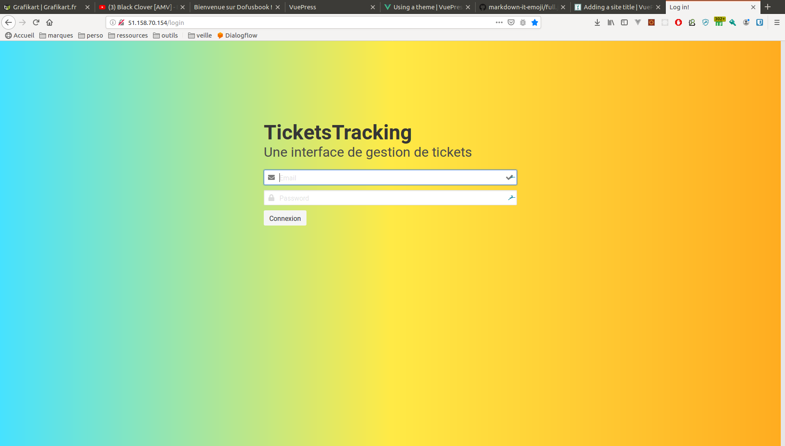

Login
=====

Spécifications
--------------
L'objectif de ce module est de permettre de se connecter à l'application de ticket. L'utilisateur devra renseigner son login et son mot de passe.
L'utilisateur devra être informé si l'un des deux champs n'est pas correcte par un message.

| Nom           |     Type        |     Required    |
| :------------ | :-------------: | :-------------: |
| Login         |     Text        |        Oui 	    |
| Password      |     Password    |        Oui      |